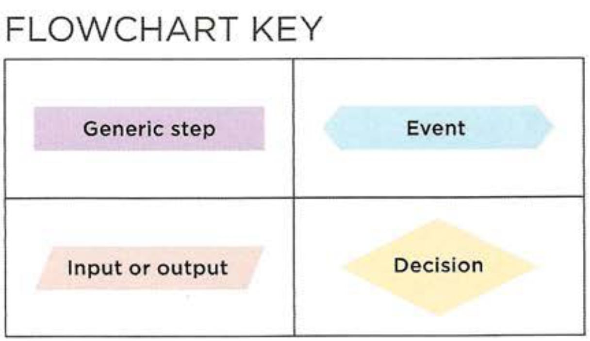

# Java Script (JS)

### ________________________________________
## What is a script and how do i create one?

* A script is a series of instructions that the computer can follow in order to achieve a goal.

* Each time the script runs, it might only use a subset of all the instructions.

* Computers approach tasks in a different way than humans, so your instructions must let the computer solve the task prggrammatically.

* To approach writing a script, break down your goal into a series of tasks and then work out each step needed to complete that task (a flowchart can help).

#### Flow chart key:

### ________________________________________

## Basic Java Script instructions:

* A script is made up of a series of statements. Each statement is like a step in a recipe.
* Scripts contain very precise instructions. For example, *you might specify that a value must be remembered before creating a calculation using that value.*
* Variables are used to temporarily store pieces of information used in the script.
* JavaScript distinguishes between numbers (0-9), strings (text), and Boolean values (true or false).
* Expressions evaluate into a single value. 
* Expressions rely on operators to calculate a value.

### ________________________________________

## Functions:

* Functions allow you to group a set of related statements together that represent a single task.
* Functions can take parameters (informatiorJ required to do their job) and may return a value.
* The code inside a functions will not execute until the function is calles by its name and parentheses (and arguements if it's need a data to do its work).

### ________________________________________

### This page wrote by [Mohamad Saad Eddin](https://github.com/MHD22).
 ***you can visit my profile and follow me***
### ________________________________________

###### Thanks for your time, I hope that you enjoyed.

